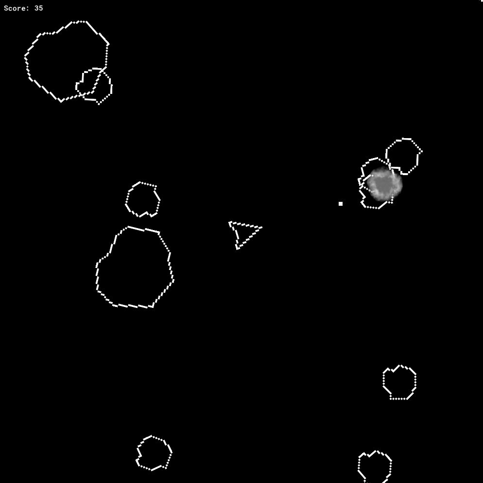
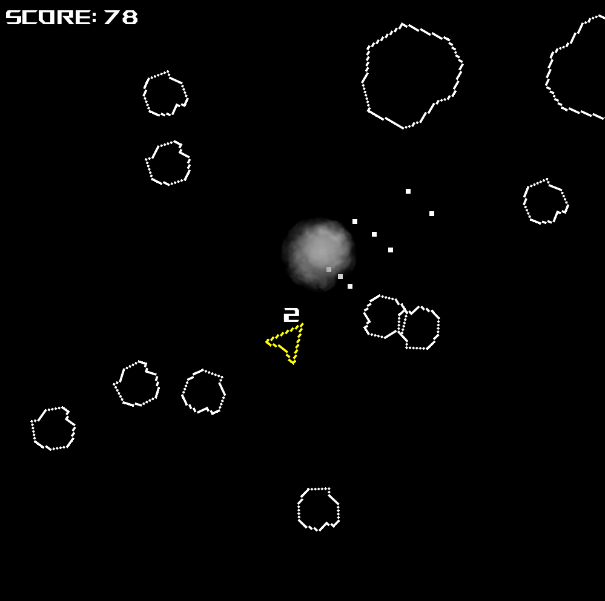
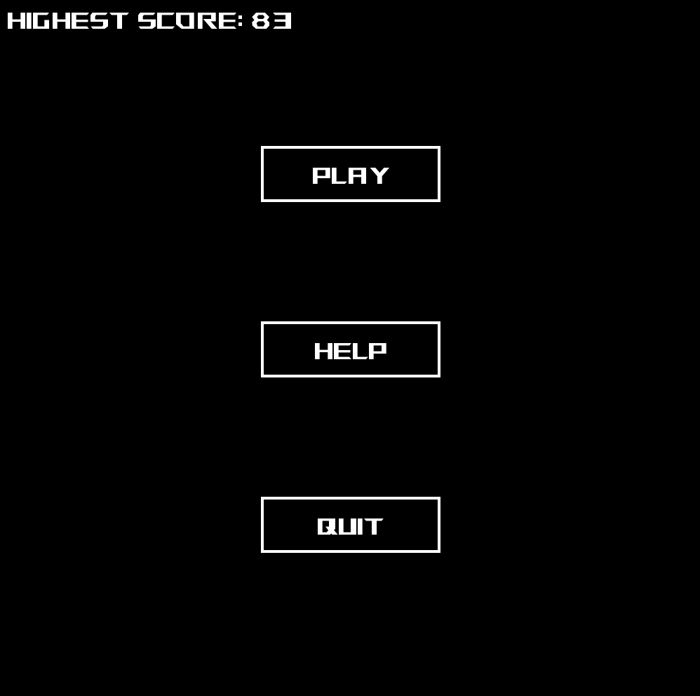

# Space Rocks
An Asteroids-like arcade space shooter game made with GameMaker.

## Description
Space Rocks is a classic arcade-style space shooter where you pilot a spaceship through an asteroid field, destroying rocks and avoiding collisions.

## How to Play
- Use arrow keys or WASD to move
- Aim with your mouse
- Left mouse click to shoot
- Destroy all asteroids to score points
- Avoid colliding with asteroids

## Assets
- **Sprites**: Player ship, bullets, and asteroid
- **Sounds**: Two 8-bit songs

##
_This is a tutorial project created for educational purposes._